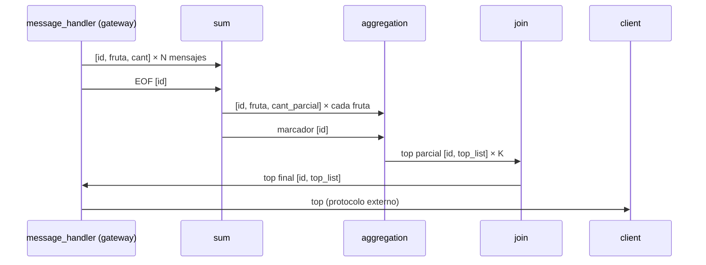
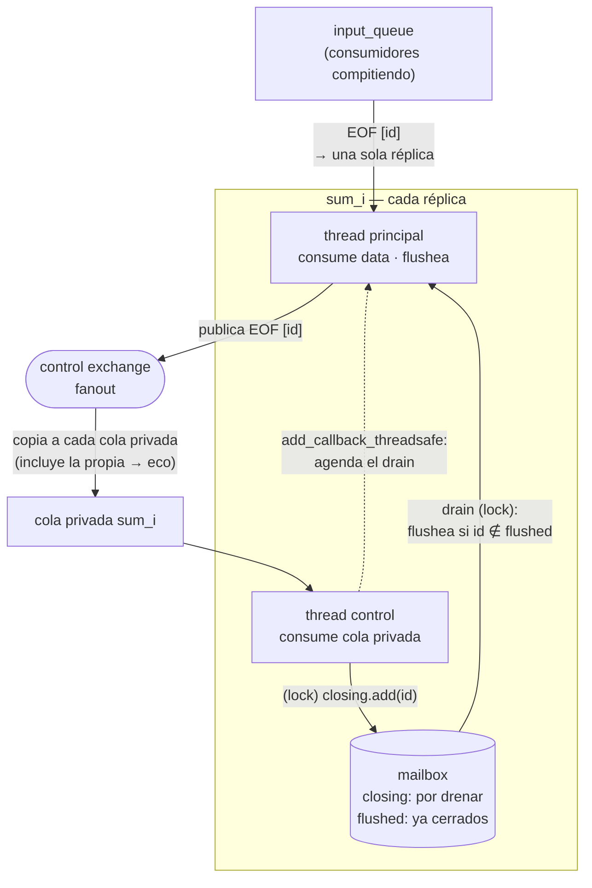
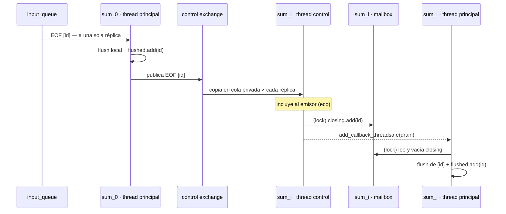

> Redactar un breve informe en el archivo `INFORME.md` explicando el modo en que se coordinan las instancias de Sum y Aggregation, así como el modo en el que el sistema escala respecto a los clientes, grándes volúmens de datos y la cantidad de controles.

## Decisiones de diseño

A continuación se detallan las decisiones de diseño tomadas para la implementación del sistema de coordinación. La intención es poder reflejar la progresión de la toma de decisiones a lo largo de los diferentes escenarios propuestos en el enunciado.

### Propagar `client_id`

La primera decisión tomada fue modificar `message_handler` del gateway con el objetivo de poder propagar el `client_id` a lo largo de la cadena de coordinación. En principio se manejaba solo `(fruit, amount)` y se realizaron las modificaciones necesarias para que se maneje `(client_id, fruit, amount)` en la serialización. Para la deserialización se incluyó el manejo del `client_id` y se aplicó un filtro para ignorar los mensajes que no correspondían al `client_id` del handler. Luego, para la serialización del `EOF` se utilizó un mensaje especial que solo contiene el `client_id`. De esta manera se diferencia el mensaje con información de largo `3` (data) del mensaje con información de largo `1` (`EOF`).

Se ajustaron las entidades a este protocolo de manera que `sum` y `aggregation` ahora esperan mensajes de largo `3`, o en su defecto, mensajes de largo `1` que indican `EOF`. El pasaje de mensajes entre las colas queda de la siguiente manera:

*Figura 1 — Propagación del `client_id` a lo largo de la cadena de coordinación.*

### `client_id` como clave de multiplexación

En principio, los mensajes se mezclaban dentro de los workers: una misma infraestructura de colas era compartida por todas las sesiones, sin forma de distinguir a quién pertenecía cada registro. En el `sum`, por ejemplo, se guardaba todo en un solo diccionario global. Los registros del cliente 0, 1 y 2 se sumaban todos juntos. Al recibir un `EOF`, se flusheaba todo el diccionario al `aggregation`, lo que provocaba que la información del `aggregation` estuviera contaminada.

Para poder solucionar este problema, se decidió utilizar el `client_id` como clave de multiplexación: la clave que permite deshacer la mezcla dentro de cada worker y mantener una sesión independiente por cliente sobre la misma infraestructura compartida. `Sum` guarda la información en un diccionario `{(client_id, fruta): cantidad}`; al llegar el `EOF` de un `client_id`, se flushean únicamente las entradas asociadas a ese `client_id`. En `aggregation`, se utiliza el `client_id` como clave para mantener separados los `top_list` de cada cliente. Se utiliza un diccionario `{client_id: [FruitItem, ...]}` para mantener esta separación. Finalmente, el gateway utiliza el `client_id` para entregar el resultado únicamente al cliente correspondiente, en lugar de repartirlo a todos los clientes conectados.

### Muchos sums, un EOF

Al replicar `sum` apareció un problema nuevo: todas las instancias consumen compitiendo de la misma `input_queue`, por lo que el `EOF` de un cliente llega a **una sola** instancia. Esa instancia flusheaba correctamente los resultados del cliente, pero el resto no advertía el `EOF` y jamás flusheaba sus resultados parciales — los resultados finales quedaban incompletos. Se necesitaba que todas las instancias se enteren del cierre de cada cliente, y además en el orden correcto: el `EOF` debe procesarse después de todos los datos de ese cliente.

La solución fue agregar un **segundo canal de comunicación** entre los `sum`: un exchange de control donde se publican los `EOF` recibidos. Se eligió un exchange porque el modelo de mailbox era ideal — cada instancia bindea su propia cola privada y recibe su copia de cada `EOF` publicado.

*Figura 2 — Topología del canal de control entre réplicas de sum*

Dentro de cada `sum` nace entonces un segundo thread dedicado a escuchar ese exchange. Este thread **no puede ejecutar el flush él mismo**: los objetos de la conexión solo pueden usarse desde el thread que los creó, y el flush implica enviar mensajes por las conexiones del thread principal. Por eso el thread de control solo deja una marca en una suerte de mailbox interno: toma el lock del set compartido `closing` y agrega el `client_id`. Luego, mediante `add_callback_threadsafe`, le agenda al loop del thread principal la ejecución del chequeo de `closing` — esto es clave porque el thread principal puede estar bloqueado esperando mensajes sin que haya ninguno en camino; la agenda es lo que lo despierta.

El thread principal ejecuta el drenado en su propio loop: toma el lock de `closing`, flushea los resultados parciales de los clientes marcados, los remueve del set, y los agrega a `flushed`, el conjunto de sesiones ya cerradas. Este segundo set también resuelve el **eco**: al ser un exchange, la instancia que publicó el `EOF` también lo recibe por su propia cola privada, y `flushed` permite ignorarlo.

*Figura 3 — Secuencia de propagación y ejecución de un EOF*

El orden data → `EOF` dentro de cada consumidor queda garantizado por `prefetch=1`: RabbitMQ solo entrega un mensaje sin confirmar por vez, de modo que el `EOF` de un cliente no puede adelantarse a los datos que el consumidor aún está procesando.

### Todos los Aggregation reciben todos los mensajes

Inicialmente, todos los aggregation recibían todos los mensajes de los sum, lo que causaba que cada instancia procesara los mismos datos y calculara el mismo top. El join recibía K resultados idénticos.

Para solucionar esto, se decidió particionar la data entre las réplicas: cada `aggregation` se asocia a un número de shard y cada `sum` decide el destino aplicando un hash sobre la fruta: `crc32(fruta) % AGGREGATION_AMOUNT`. Es fundamental que el hash sea determinístico y compartido: la misma fruta debe caer siempre en el mismo shard sin importar qué réplica de `sum` la procesó — de lo contrario el total de una fruta quedaría repartido entre shards y ninguno tendría el dato completo. Por este motivo no se puede usar el `hash()` de Python, que varía de proceso en proceso.

Sobre este canal conviven dos políticas de envío: los mensajes de data se envían a **un** shard (el dueño de la fruta), mientras que los mensajes de EOF se envían a **todos**, ya que cada shard debe conocer el cierre de cada cliente para emitir su top parcial.

Esto a su vez, trajo un cambio en el comportamiento del join. Inicialmente el join era un pasamanos de los tops calculados por los aggregation, al incluir el sharding por fruta, ahora es el encargado de mergear los K tops parciales en un top final por cliente.

### Protocolo de cierre por sesión

Para resolver el problema de cómo sabe un `aggregation` o un `join` que ya recibió todo lo de un cliente, se definió un cierre por conteo de señales, distinto en cada tramo.

En el tramo `sum` → `aggregation` la cantidad de mensajes de data es desconocida, por lo que se necesita una señal explícita: cada `sum` envía un marcador `[id]` a todos los shards, y cada `aggregation` emite su top parcial solo cuando acumuló `SUM_AMOUNT` marcadores de ese cliente.

En el tramo `aggregation` → `join` no hace falta un marcador aparte: cada `aggregation` emite exactamente un mensaje por cliente — su top parcial `[id, top_list]` — por lo que el `join` cuenta parciales hasta `AGGREGATION_AMOUNT` y mergea. Por eso un shard que no recibió data de un cliente igual debe emitir su parcial vacío `[]`: de lo contrario el `join` jamás completaría el conteo.

### Graceful shutdown ante `SIGTERM`

Finalmente, se agregó el manejo de la señal `SIGTERM` para que los workers cierren ordenadamente cuando Docker los detiene. Sin handler, el proceso muere instantáneamente en cualquier punto, potencialmente a mitad de un envío.

Se reutilizó la misma idea del canal de control: el handler no ejecuta el cierre directamente (podría interrumpir una operación a mitad de camino), sino que agenda `stop_consuming` en la conexión de cada consumidor mediante `add_callback_threadsafe`. Cuando el loop corre el stop agendado, `start_consuming` retorna, se ejecutan los `close()` que le siguen en el código y el proceso termina limpiamente. En `sum`, que tiene dos consumidores, se agenda el stop en ambas conexiones y se espera al thread de control con `join()` antes de cerrar.

## Escalabilidad

Para escalar en cantidad de clientes, no es necesario agregar nada en particular, la propia multiplexación del `client_id` hace que escalar sea tan simple como agregar entradas a los diccionarios particionados.

En cuanto a **volúmenes de datos**, los componentes almacenan la información del cliente mientras no esté flusheada y de manera "acumulativa". Es decir, no se guarda cada mensaje de manera individual sino que se van sumando de acuerdo a la lógica de negocio, por lo que la memoria crece con la cantidad de claves distintas y no con la cantidad de mensajes procesados.

Respecto a los **controles**, la cantidad no varía, es fija según las constantes de configuración `SUM_AMOUNT` y `AGGREGATION_AMOUNT`. Estas determinan la cantidad de marcadores por shard y la cantidad de parciales por join.